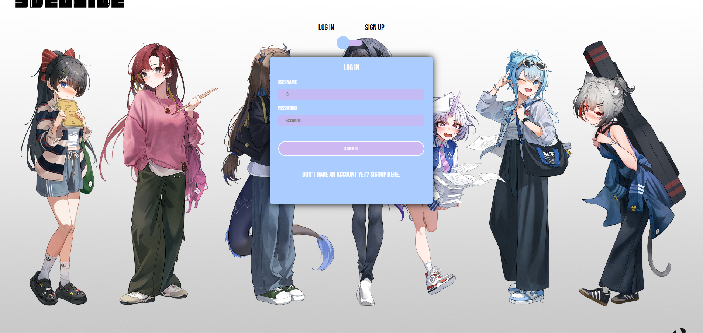
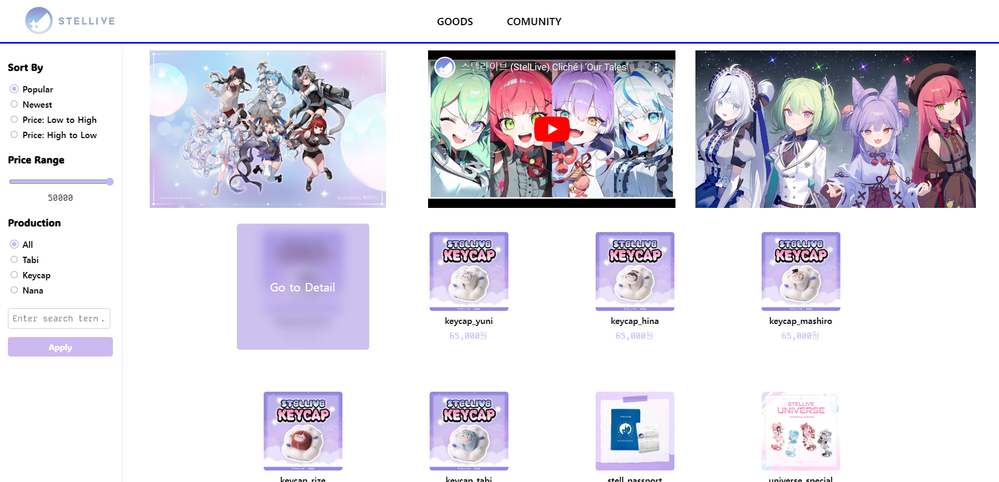
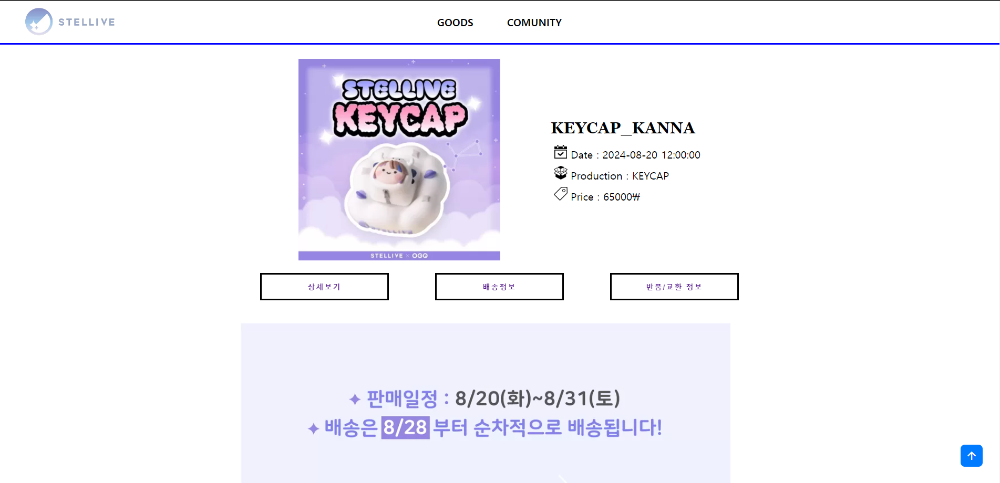
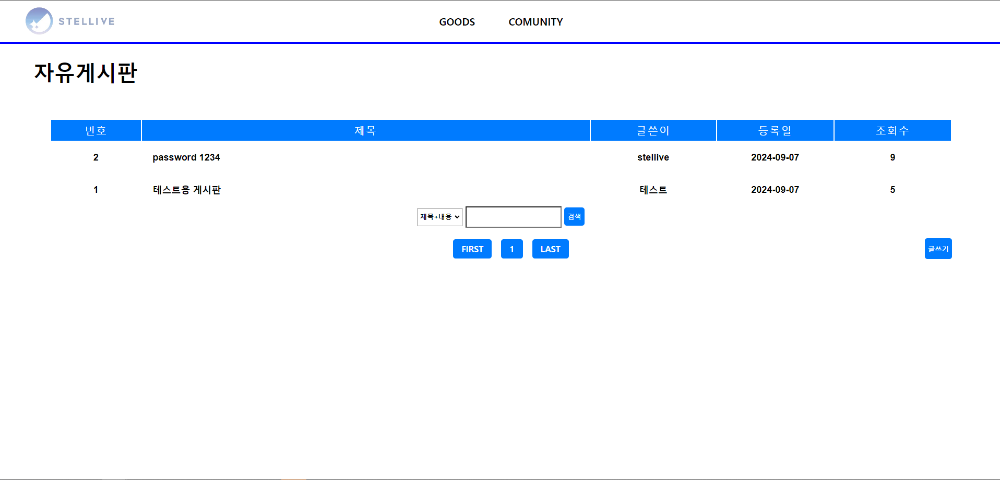

# **Stellive Goods Shop**
<!--프로젝트 메인 이미지-->


<hr>

<!--목차-->
## 목차
- [**Project**](#project)
    - [Features](#features)
    - [Techniques](#techniques)
- [**Page**](#page)
    - [Regist Page](#regist-page)
    - [Main Page](#main-page)
    - [Goods Detail Page](#goods-detail-page)
    - [Comunity Page](#comunity-page)
- [**Contact**](#contact)

<hr>

<!--프로젝트 설명-->
## **Project**
- 해당 프로젝트는 인터넷 방송인 그룹 **Stellive**의 최신 굿즈 판매를 위한 사이트 입니다.
- php와 DataBase를 이용한 쇼핑몰의 구조와 개발 방법 공부를 중점으로 하여 진행되었습니다.
- Register Page에서 Login 및 Sign up을 통해 Main Page로 진입이 가능합니다.

### **Features**
- DataBase에 등록된 굿즈를 순서대로 확인하며 SideBar를 통해 정렬 및 검색이 가능합니다.
- 정렬로는 인기순, 최신순, 가격이 낮은 것부터 높은 것 혹은 반대로 정렬이 가능합니다.
- 각 제품별로 정렬된 Production값을 통해 검색이 가능하며 제품명으로도 검색이 가능합니다.
- Detail 페이지에서 제품의 상세 정보 및 배송 / 환불에 관한 정보를 얻을 수 있습니다.

### **Techniques**
- [PHP]
- [phpMyAdmin]
- [HTML5], [CSS3], [JavaScript]
- [Visual Studio Code]
- [Bootstrap]

<hr>

<!--각 페이지 설명-->
## **Page**

### **Regist Page**

- **Regist Page**입니다. 해당 페이지는 초기 로드 화면으로 DB에 등록된 아이디를 통해 접속이 가능합니다.
- 상단의 버튼을 통해 Login과 Sign up을 통해 아이디 등록 및 접속이 가능합니다.

### **Main Page**

- **Main Page**입니다. 상단 멤버 전원의 이미지를 볼 수 있으며 3기 Cliche의 Group music을 들을 수 있습니다.
- SideBar를 통해 정렬 및 검색이 가능하며 이미지 클릭으로 상세 페이지로 이동할 수 있습니다.
- 각 굿즈 정보는 Primary key인 id로 확인 가능합니다.

### **Goods Detail page**

- **Goods Detail page**입니다. Url의 id값을 통해 각 굿즈의 name, date, production, price를 적용합니다.
- 해당 제품의 상세 정보, 배송, 반품 및 교환에 관한 정보를 얻을 수 있습니다.

### **Comunity Page**

-  **Comunity Page**입니다. Bootstrap을 통해 디자인하였습니다.
- 각 게시판의 정보는 Primary key의 id로 구성되며 password_hash를 이용해 단방향 암호화를 적용하였습니다.
```
// 비밀번호 단방향 암호화
$pwd_hash = password_hash($password, PASSWORD_BCRYPT);
```
- 이미지의 경우 preg_match_all를 이용해 변환하여 DB에 등록하였습니다.
```
// 정규식, 정규표현식 EXP
preg_match_all("/]*src=[\"']?([^>\"']+)[\"']?[^>]*>/i", $content, $matches);
```
<hr>

<!--접근-->
## **Contact**
- 📧  **wodnd565@gmail.com**
- 📞  **010 - 5657 - 4813**
